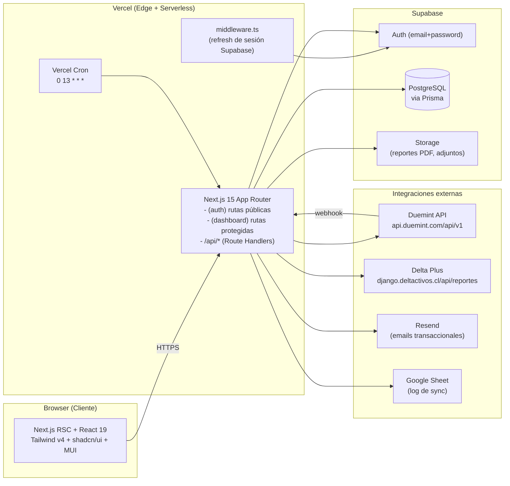
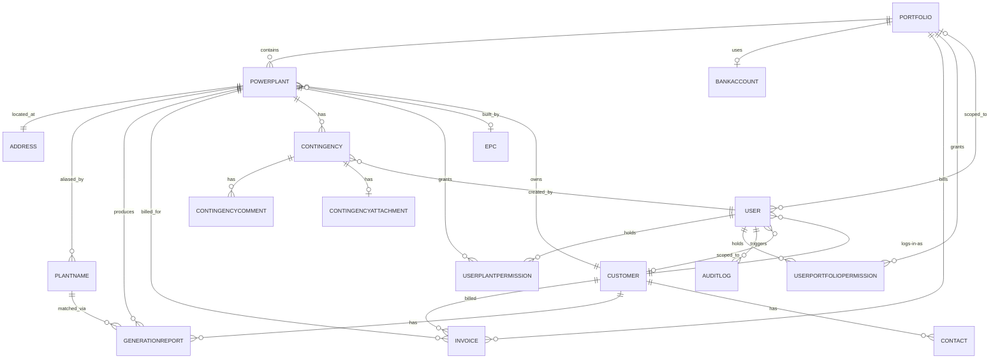
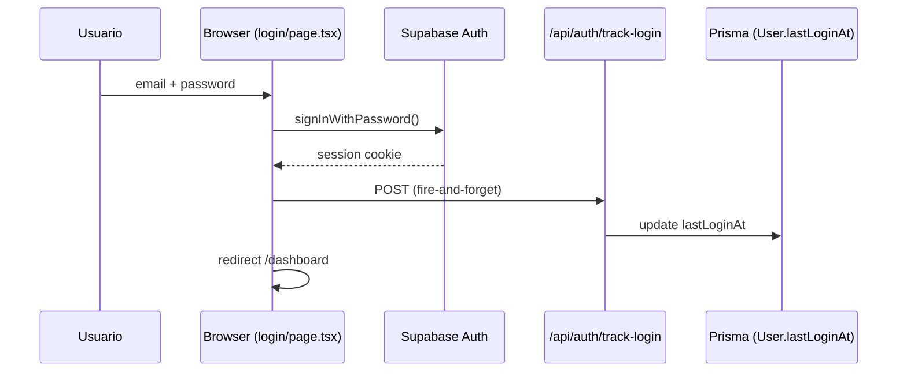
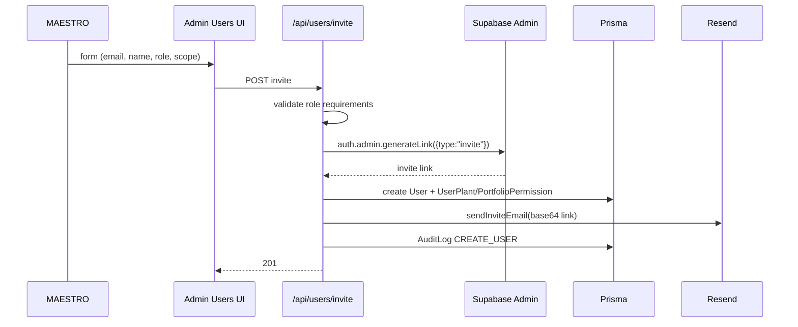
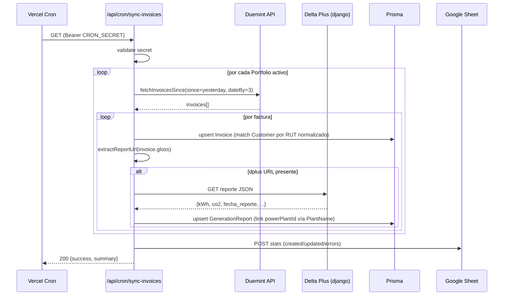
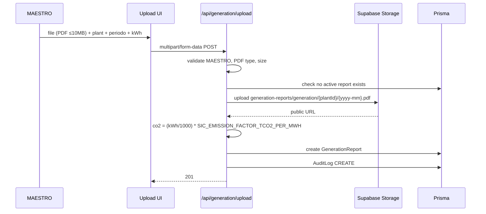
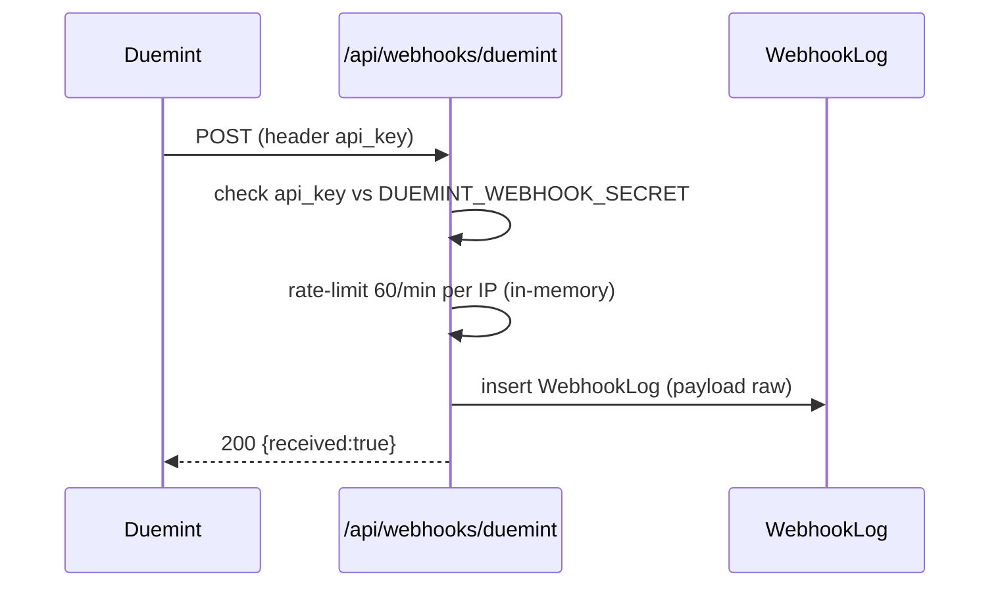

# S-Invest — Project Overview

> Documento vivo. Fuente de verdad: el código. Si algo acá contradice al repo, gana el repo y se corrige este documento.
> Última actualización: **2026-04-27**.

---

## 1. Resumen Ejecutivo

**S-Invest** es una plataforma web de gestión y visibilidad de portafolios de inversión solar. S-Invest financia proyectos fotovoltaicos: es **dueña temporal** de la planta por un período de `N` años durante los cuales el cliente paga por financiamiento, generación y mantención. Al término del plazo, la propiedad se transfiere al cliente. Operativamente, desde el día uno la planta se identifica como "del cliente" (un `Customer` puede tener múltiples `PowerPlant`).

**Público objetivo**
- **Equipo interno S-Invest** (`MAESTRO`, y a futuro `OPERATIVO` / `TECNICO`): carga de datos, administración de plantas, contingencias de mantenimiento, revisión de facturación.
- **Clientes finales** (`CLIENTE`, `CLIENTE_PERFILADO`): visibilidad de producción, facturación y estado de sus plantas.

**Propuesta de valor**
- Para el cliente: un solo lugar para ver producción (kWh), CO₂ evitado, facturación y estado de mantención de todas sus plantas.
- Para S-Invest: operación centralizada de portafolios, automatización del ciclo de facturación vía Duemint, y trazabilidad auditable.

**Estado del proyecto**
Piloto en **producción con lanzamiento controlado**. Iteración activa (último commit del día en `main`). Una sola migración Prisma inicial (`20260327005132_init`) — ver §17 sobre deuda técnica con migraciones.

---

## 2. Glosario de Dominio

| Término | Definición en S-Invest |
|---|---|
| **Portafolio** (`Portfolio`) | Vehículo de inversión que agrupa plantas y facturación. Tiene una cuenta bancaria receptora y un `duemintCompanyId` único para emitir facturas. |
| **Cliente** (`Customer`) | Empresa/persona identificada por RUT que posee (o poseerá) las plantas. No se confunde con `User` (login). |
| **Planta** (`PowerPlant`) | Instalación fotovoltaica física. Pertenece a un `Portfolio` **y** a un `Customer`. Tiene dirección, EPC instalador, capacidad (kW), fecha de inicio y duración del financiamiento (`durationYears`). |
| **EPC** (`Epc`) | Engineering, Procurement & Construction — empresa que construyó la planta. |
| **Contacto** (`Contact`) | Persona de contacto asociada a un Customer (nombre, rut, email, teléfono). No tiene acceso al sistema por sí mismo. |
| **Contingencia** (`Contingency`) | Evento de mantenimiento: preventivo (`PREVENTIVE`) o correctivo (`CORRECTIVE`). Tiene estado (`OPEN` → `IN_PROGRESS` → `CLOSED`), proveedor, costo, comentarios y adjuntos. |
| **Factura** (`Invoice`) | Documento tributario emitido vía Duemint. Cubre financiamiento, generación y/o mantención. La `gloss` de la factura puede contener un link al reporte Delta Plus del período. |
| **Reporte de generación** (`GenerationReport`) | Registro mensual por planta con `kwhGenerated` y `co2Avoided`. Fuente: reporte Delta Plus (automático vía Duemint gloss) o carga manual de PDF. |
| **Delta Plus (dplus)** | Proveedor externo de reportes técnicos de generación; expone una API JSON (`django.deltactivos.cl`). El link al reporte viaja dentro del `gloss` de las facturas Duemint. |
| **Duemint** | Plataforma de facturación electrónica chilena. Una instancia (`duemintCompanyId`) por portafolio. |
| **Solcor ID** (`solcorId`) | Identificador externo (SEC/CEN) de la planta. |
| **Portafolio activo** (selección de usuario) | Scope actual del usuario en UI. Rutas bajo `/(portfolio)/[portfolioId]/*` operan dentro de ese scope. |

---

## 3. Arquitectura

### 3.1 Diagrama de alto nivel



### 3.2 Patrón arquitectónico

**Monolito modular** sobre el App Router de Next.js 15. No hay microservicios ni message bus; el trabajo "asíncrono" vive en:
- **Cron serverless** de Vercel ([vercel.json](vercel.json)) → `/api/cron/sync-invoices`.
- **Webhook receiver** → `/api/webhooks/duemint`.
- **Scripts manuales** de operación en [scripts/](scripts/).

La frontera principal de código es **rutas (UI) vs. servicios (`src/lib/services/`) vs. acceso (`src/lib/auth/`)**. No hay Clean / Hexagonal estricta.

### 3.3 Stack por capa

| Capa | Tecnología |
|---|---|
| **Frontend** | Next.js 15 (App Router, RSC), React 19, TypeScript 5.8, Tailwind CSS v4, shadcn/ui (New York), MUI 7 (tablas densas), Chart.js + react-chartjs-2, react-pdf, sonner (toasts), nextjs-toploader, Lucide icons |
| **Backend** | Next.js Route Handlers (`src/app/api/*`), Zod (validación), Prisma 6.6 (ORM) |
| **DB** | PostgreSQL en Supabase (Pooler pgbouncer `6543` + direct `5432`) |
| **Auth** | Supabase Auth (`@supabase/ssr`, `@supabase/supabase-js`) — email+password |
| **Storage** | Supabase Storage (bucket `generation-reports` para PDFs, adjuntos de contingencias) |
| **Email** | Resend |
| **Hosting** | Vercel (Cron + serverless) |
| **Regulación/compliance** | ❓ No documentado formalmente (ver §7 y *Preguntas abiertas*) |

### 3.4 Responsabilidades por capa/directorio

- [src/app/(auth)/](src/app/(auth)/) — UI pública: login, forgot-password, activate, set-password.
- [src/app/(dashboard)/](src/app/(dashboard)/) — UI protegida: vistas globales + vistas scoped por `portfolioId`.
- [src/app/api/](src/app/api/) — Route Handlers: auth, CRUD de entidades, webhook y cron.
- [src/lib/auth/](src/lib/auth/) — RBAC, guards, `getAccessiblePowerPlantIds`.
- [src/lib/supabase/](src/lib/supabase/) — clientes: `server`, `client` (browser), `admin` (service role).
- [src/lib/services/](src/lib/services/) — integraciones externas: Duemint, Resend, Delta Plus, audit.
- [src/lib/mui/](src/lib/mui/) — theme registry de MUI alineado a los tokens M3.
- [prisma/](prisma/) — schema, seed, migración inicial y scripts de importación de datos.

### 3.5 ADRs (inferidos del código; no hay archivos ADR formales)

| ADR implícito | Decisión |
|---|---|
| ADR-01 | **Usar Supabase para Auth + Postgres + Storage** (en vez de Auth0/S3/otros) — reduce dependencias, un solo dashboard operativo. |
| ADR-02 | **App Router + RSC** en vez de Pages Router — alineación con Next.js 15 y data fetching server-side. |
| ADR-03 | **shadcn/ui + MUI conviven** — shadcn para layout/forms; MUI para tablas densas de datos (ver §9). |
| ADR-04 | **Soft delete universal** (`active` 1/0) en vez de `DELETE` físico — preservar historia y recuperabilidad. |
| ADR-05 | **Un `duemintCompanyId` por `Portfolio`** — cada portafolio factura por separado en Duemint. |
| ADR-06 | **Reportes Delta Plus se descubren vía `gloss` de factura Duemint** — acoplamiento explícito a la operación Duemint+Delta Plus. |

---

## 4. Modelo de Datos

### 4.1 Diagrama ER (dominio principal)



### 4.2 Entidades principales (referencia: [prisma/schema.prisma](prisma/schema.prisma))

| Entidad | Archivo:línea | Función | Claves |
|---|---|---|---|
| `Portfolio` | [schema.prisma:63-83](prisma/schema.prisma#L63-L83) | Vehículo inversión | `duemintCompanyId`, FK `bankAccountId` |
| `BankAccount` | [schema.prisma:46-61](prisma/schema.prisma#L46-L61) | Cuenta receptora de pagos | `rut` unique |
| `Customer` | [schema.prisma:85-101](prisma/schema.prisma#L85-L101) | Dueño/futuro dueño de plantas | `rut` unique |
| `Contact` | [schema.prisma:103-119](prisma/schema.prisma#L103-L119) | Contactos del Customer | FK `customerId` |
| `PowerPlant` | [schema.prisma:154-193](prisma/schema.prisma#L154-L193) | Planta física | FKs `portfolioId`, `customerId`, `epcId`; `capacityKw`, `startDate`, `durationYears` |
| `Address` | [schema.prisma:121-139](prisma/schema.prisma#L121-L139) | Ubicación 1-1 con planta | `powerPlantId` unique, `lat`/`lng` |
| `Epc` | [schema.prisma:141-152](prisma/schema.prisma#L141-L152) | Constructor de la planta | `name` unique |
| `PlantName` | [schema.prisma:254-267](prisma/schema.prisma#L254-L267) | Alias de planta para matching con Delta Plus | `name` unique |
| `GenerationReport` | [schema.prisma:269-297](prisma/schema.prisma#L269-L297) | Reporte mensual kWh/CO₂ | único (`powerPlantId`,`periodMonth`,`periodYear`); `duemintId` unique; `rawJson` (snapshot Delta Plus) |
| `Invoice` | [schema.prisma:299-350](prisma/schema.prisma#L299-L350) | Factura Duemint | `duemintId` unique; `gloss` (TEXT, contiene dplus URL) |
| `Contingency` | [schema.prisma:352-376](prisma/schema.prisma#L352-L376) | Evento de mantención | `type`, `status`, `cost`, `closedAt` |
| `ContingencyComment` / `ContingencyAttachment` | [schema.prisma:378-411](prisma/schema.prisma#L378-L411) | Hilo + adjunto único | FK `contingencyId` |
| `User` | [schema.prisma:195-222](prisma/schema.prisma#L195-L222) | Login + rol | `supabaseId` y `email` unique; FKs `customerId`, `assignedPortfolioId` |
| `UserPlantPermission` | [schema.prisma:224-237](prisma/schema.prisma#L224-L237) | Scope para CLIENTE_PERFILADO | unique (`userId`,`powerPlantId`) |
| `UserPortfolioPermission` | [schema.prisma:239-252](prisma/schema.prisma#L239-L252) | Scope para TECNICO | unique (`userId`,`portfolioId`) |
| `AuditLog` | [schema.prisma:413-430](prisma/schema.prisma#L413-L430) | Auditoría de acciones | `action`, `entityType`, `entityId`, `metadata` JSON |
| `WebhookLog` | [schema.prisma:432-444](prisma/schema.prisma#L432-L444) | Historial de webhooks | `source`, `eventType`, `payload`; sin `active` |

**Enums** ([schema.prisma:15-40](prisma/schema.prisma#L15-L40))
- `UserRole`: `MAESTRO`, `OPERATIVO`, `CLIENTE`, `CLIENTE_PERFILADO`, `TECNICO`.
- `ContingencyType`: `PREVENTIVE`, `CORRECTIVE`.
- `ContingencyStatus`: `OPEN`, `IN_PROGRESS`, `CLOSED`.
- `InvoiceStatus`: `PENDING`, `PAID`, `OVERDUE`, `CANCELLED`, `SYNCED`.

### 4.3 Reglas transversales

- **IDs**: `Int autoincrement` en todas las tablas (no CUID/UUID).
- **Soft delete**: `active` (1/0) + `created_at` + `updated_at` en todas las tablas **excepto** `WebhookLog` (audit-only, inmutable).
- **Cascadas**:
  - `CASCADE`: `Contact`→Customer; `UserPlantPermission`, `UserPortfolioPermission`, `ContingencyComment`, `ContingencyAttachment`.
  - `RESTRICT`: `PowerPlant`→Portfolio/Customer; `Contingency`→PowerPlant/User; `AuditLog`→User.
- **Constraint clave**: `GenerationReport` único por `(powerPlantId, periodMonth, periodYear)` — no permite dos reportes del mismo mes para una planta.

### 4.4 Migraciones y retención

- Una sola migración: [prisma/migrations/20260327005132_init/](prisma/migrations/20260327005132_init/).
- `🔍 Pendiente de verificar`: el SQL de la migración inicial usa columnas `TEXT` para IDs, mientras el `schema.prisma` actual declara `Int autoincrement`. Esto sugiere que el schema se refactorizó y se aplicó con `prisma db push` en vez de generar nueva migración → ver *Deuda Técnica* §17.
- **Retención**: no hay política automatizada de archivado/purge. [scripts/purge-inactive-users.ts](scripts/purge-inactive-users.ts) ofrece borrado duro manual de usuarios inactivos (reasigna contingencias/comentarios a otro email).
- **Soft delete**: los registros con `active=0` no se muestran pero no se eliminan.

---

## 5. Módulos y Funcionalidades

| Módulo | UI | APIs | Servicios | Estado |
|---|---|---|---|---|
| **Auth** | [src/app/(auth)/](src/app/(auth)/) login / forgot-password / activate / set-password | `/api/auth/{callback,track-login,forgot-password,change-password}` | Supabase Auth, Resend | Operativo |
| **Portafolios** | [(dashboard)/portfolios/](src/app/(dashboard)/portfolios/), [(portfolio)/[portfolioId]/overview](src/app/(dashboard)/(portfolio)/[portfolioId]/overview/) | `/api/portfolios`, `/api/portfolios/[portfolioId]` | — | Operativo |
| **Plantas** | [(dashboard)/power-plants/](src/app/(dashboard)/power-plants/), [(portfolio)/…/power-plants/](src/app/(dashboard)/(portfolio)/[portfolioId]/power-plants/) | `/api/power-plants`, `/api/power-plants/[powerPlantId]`, `/api/power-plants/export` | — | Operativo |
| **Contingencias** | [(dashboard)/contingencies/](src/app/(dashboard)/contingencies/), scoped por planta | `/api/contingencies`, `…/comments`, `…/attachment` | Supabase Storage | Operativo |
| **Facturación** | [(dashboard)/billing/](src/app/(dashboard)/billing/), [(portfolio)/…/billing/](src/app/(dashboard)/(portfolio)/[portfolioId]/billing/), [report/[duemintId]](src/app/(dashboard)/report/[duemintId]/) | `/api/billing/{invoices,sync-since,import}` | `duemint.service`, `report-extraction.service` | Operativo |
| **Generación** | [(portfolio)/…/power-plants/[id]/generation](src/app/(dashboard)/(portfolio)/[portfolioId]/power-plants/[powerPlantId]/generation/), [(dashboard)/reports/](src/app/(dashboard)/reports/) | `/api/generation`, `/api/generation/upload` | Supabase Storage (manual), Delta Plus (auto) | Operativo |
| **Clientes** | [(dashboard)/admin/customers/](src/app/(dashboard)/admin/customers/) | `/api/customers`, `/api/customers/[customerId]` | — | Operativo |
| **Usuarios (admin)** | [(dashboard)/admin/users/](src/app/(dashboard)/admin/users/) | `/api/users`, `/api/users/invite`, `/api/users/[userId]` | Supabase Admin, Resend | Operativo |
| **Bancos** | — (admin embedded) | `/api/bank-accounts` | — | Operativo |
| **Cron & Webhooks** | — | `/api/cron/sync-invoices`, `/api/webhooks/duemint` | `duemint`, `report-extraction`, Google Sheet webhook | Cron operativo; webhook receiver en modo "log-only" — ver §17 |

**Dependencias entre módulos**: Plantas → Portafolio + Customer + EPC. Facturación → Customer + (opcional) Portafolio + Planta + dispara Generación vía gloss. Generación → Planta + Customer + PlantName.

---

## 6. Flujos Principales

### 6.1 Login



### 6.2 Invitación de usuario (MAESTRO)



Requisitos de scope por rol aplicados en [src/app/api/users/invite/route.ts](src/app/api/users/invite/route.ts):
- `CLIENTE` / `CLIENTE_PERFILADO` → `customerId` obligatorio.
- `CLIENTE_PERFILADO` → `plantIds[]` (≥1) validando que pertenezcan al customer.
- `OPERATIVO` → `assignedPortfolioId` obligatorio.
- `TECNICO` → `portfolioIds[]` (≥1).

### 6.3 Sync diario de facturas Duemint (cron 09:00 SCL / 13:00 UTC)



Archivo clave: [src/app/api/cron/sync-invoices/route.ts](src/app/api/cron/sync-invoices/route.ts). `maxDuration=300s` (Vercel Pro timeout).

### 6.4 Carga manual de reporte de generación (MAESTRO)



### 6.5 Webhook Duemint (estado actual)



⚠️ **Solo loguea**, no procesa. Ver §17 *Deuda técnica*.

---

## 7. Seguridad de la Información

### 7.1 Autenticación

- **Proveedor**: Supabase Auth (email + password). No hay OAuth social activo, no MFA.
- **Sesiones**: cookies HTTP-only gestionadas por `@supabase/ssr`; el middleware ([src/middleware.ts](src/middleware.ts)) refresca la sesión en cada request y redirige a `/login` si no autenticado, o a `/dashboard` si autenticado llega a `/login`.
- **PKCE implicit grant** en [set-password/page.tsx](src/app/(auth)/set-password/page.tsx) para flujo de invitación/recuperación.
- **Callback OAuth** en [/api/auth/callback](src/app/api/auth/callback/route.ts) con protección contra open-redirect.
- **Política de password**: mínimo 8 caracteres con mayúscula, minúscula y número (validación cliente en `set-password`; sólo min 8 en `/api/auth/change-password`).
- **Prevención de enumeración**: `/api/auth/forgot-password` siempre devuelve 200.

### 7.2 Autorización (RBAC)

Implementada en [src/lib/auth/](src/lib/auth/):
- [roles.ts](src/lib/auth/roles.ts) — `ROLE_ACCESS` (prefijos de ruta por rol) y `ROLE_PERMISSIONS` (acciones por rol), con wildcard `"*"` para `MAESTRO`.
- [guards.ts](src/lib/auth/guards.ts) — `requireAuth`, `requireRole`, `getAccessiblePowerPlantIds`, `buildPlantAccessFilter`, `requirePortfolioAccess`.
- [session.ts](src/lib/auth/session.ts) — `getCurrentUser()` une Supabase user con Prisma User activo.

**Reglas de scoping por rol**:

| Rol | Alcance de plantas |
|---|---|
| `MAESTRO` | `"all"` — acceso total |
| `OPERATIVO` | Plantas del `assignedPortfolioId` |
| `CLIENTE` | Plantas donde `PowerPlant.customerId == user.customerId` |
| `CLIENTE_PERFILADO` | Plantas listadas en `UserPlantPermission` |
| `TECNICO` | Plantas de los portafolios listados en `UserPortfolioPermission` |

### 7.3 Protección de datos

- **In-transit**: HTTPS forzado (HSTS 1 año con `includeSubDomains; preload` en [next.config.ts](next.config.ts)).
- **At-rest**: delegado a Supabase (Postgres + Storage). 🔍 No hay cifrado adicional a nivel app.
- **Headers de seguridad** ([next.config.ts](next.config.ts)): HSTS, `X-Content-Type-Options: nosniff`, `X-Frame-Options: DENY`, `X-XSS-Protection`, `Referrer-Policy: strict-origin-when-cross-origin`, `Permissions-Policy` cerrando camera/microphone/geolocation.
- **CSP**: `default-src 'self'` + `script-src 'self' 'unsafe-inline' 'unsafe-eval'` (❓ `'unsafe-eval'` necesario por Next dev build/Chart.js — revisar en prod), imgs/connect/frame limitados al host Supabase. `object-src 'none'`, `form-action 'self'`.
- **PII**: mínima por diseño — email y nombre. Posible marco aplicable: **Ley 19.628 (Chile)** sobre datos personales. 🔍 No hay aviso de privacidad ni política de retención documentada en el repo.

### 7.4 Gestión de secretos

Archivos `.env.example` / `.env.local`. No hay Vault/KMS. Secretos en variables de entorno de Vercel (ver §15). ❓ No hay rotación documentada.

### 7.5 Auditoría y trazabilidad

- [AuditLog](prisma/schema.prisma#L413-L430) — `action` + `entityType` + `entityId` + `metadata` JSON.
- Escritura vía [src/lib/services/audit.service.ts](src/lib/services/audit.service.ts) — fire-and-forget, no bloqueante.
- Acciones observadas loggeadas: `CREATE_USER` (invite), `CREATE` (upload de reporte de generación). 🔍 Cobertura no es exhaustiva en todas las mutaciones.
- [WebhookLog](prisma/schema.prisma#L432-L444) — registro inmutable de webhooks entrantes con payload crudo.

### 7.6 Superficie de ataque conocida

- **Webhook Duemint**: autenticación por header `api_key` compartido (no HMAC firmado). Rate limit en memoria (no resiste reinicio ni escalado horizontal).
- **Cron endpoint**: Bearer `CRON_SECRET` — suficiente para Vercel Cron; no debe exponerse.
- **Upload de PDFs**: tipo y tamaño validados server-side (≤10MB). 🔍 No hay análisis antimalware del archivo subido.
- **Service role key** sólo en servidor ([admin.ts](src/lib/supabase/admin.ts)).
- **CSP con `unsafe-eval`/`unsafe-inline`** — relajado; endurecer si es viable sin romper Next/Chart.js.

### 7.7 Consideraciones regulatorias

- **CMF / Ley de Fondos**: ❓ Sin evidencia en código. El negocio es financiamiento privado planta-cliente, no intermediación de fondos públicos a priori — pendiente confirmar si aplica registro.
- **Coordinador Eléctrico Nacional / SEC (PMGD)**: fuera del scope de esta app (datos técnicos de generación vienen de Delta Plus, no se reporta al CEN desde acá).
- **Ley 19.628 (protección de datos)**: aplica por manejo de email+nombre; 🔍 sin aviso de privacidad ni política de retención en el repo.
- **PCI-DSS**: no aplica (no se procesan pagos con tarjeta en la app).
- **KYC/AML**: no existe flujo en el código — onboarding de clientes es comercial/manual.

---

## 8. APIs e Integraciones

### 8.1 API interna

Convenciones observadas:
- **Protocolo**: REST sobre Route Handlers (no GraphQL, no gRPC).
- **Auth**: sesión Supabase via cookies; cada handler llama `getCurrentUser()` o `requireRole(...)`. Webhook/cron usan header secreto.
- **Versionado**: no versionado (sin prefijo `/v1/`).
- **Validación**: Zod en rutas que reciben body estructurado.

**Resumen de endpoints** (rol entre paréntesis; "auth" = cualquier usuario autenticado):

| Path | Métodos | Rol | Descripción |
|---|---|---|---|
| `/api/auth/callback` | GET | público | Intercambia code por sesión, update `lastLoginAt`, redirect protegido |
| `/api/auth/track-login` | POST | auth | Fire-and-forget update de `lastLoginAt` |
| `/api/auth/forgot-password` | POST | público | Genera recovery link Supabase + Resend; 200 siempre |
| `/api/auth/change-password` | POST | auth | Valida password actual y cambia |
| `/api/users` | GET | MAESTRO | Lista usuarios activos con relaciones |
| `/api/users/invite` | POST | MAESTRO | Alta de usuario + scope + email |
| `/api/users/[userId]` | GET/PATCH/DELETE | MAESTRO | CRUD (soft-delete) |
| `/api/customers` | GET | auth | Lista customers |
| `/api/customers/[customerId]` | GET/PATCH | MAESTRO | Detalle / edición |
| `/api/portfolios` | GET | auth | Lista portafolios activos |
| `/api/portfolios/[portfolioId]` | GET/PATCH | MAESTRO | Detalle / edición |
| `/api/power-plants` | GET/POST | auth + scope | Scoped por `getAccessiblePowerPlantIds` |
| `/api/power-plants/[powerPlantId]` | GET/PATCH/DELETE | MAESTRO + scope | |
| `/api/power-plants/export` | GET | MAESTRO | Export CSV |
| `/api/contingencies` | GET/POST | OPERATIVO/TECNICO/MAESTRO | Scoped |
| `/api/contingencies/[contingencyId]` | GET/PATCH | auth + scope | |
| `/api/contingencies/[contingencyId]/comments` | GET/POST | auth | Hilo de comentarios |
| `/api/contingencies/[contingencyId]/attachment` | POST | auth | Upload a Supabase Storage |
| `/api/bank-accounts` | GET/POST/PATCH/DELETE | MAESTRO | CRUD |
| `/api/billing/invoices/[invoiceId]` | PATCH | auth | Re-sync de una factura + su reporte linkeado |
| `/api/billing/sync-since` | POST | MAESTRO | Sync manual desde fecha |
| `/api/billing/import` | GET/POST | MAESTRO | Preview / confirmación de alta de factura puntual |
| `/api/generation` | GET | auth + scope | Lista reportes filtrados por plantId/año |
| `/api/generation/upload` | POST | MAESTRO | Upload PDF + crear reporte |
| `/api/webhooks/duemint` | POST | header `api_key` | Recibe y loggea (no procesa) |
| `/api/cron/sync-invoices` | GET | Bearer `CRON_SECRET` | Cron diario |

### 8.2 Integraciones externas

| Sistema | Servicio | Archivo | Env vars |
|---|---|---|---|
| **Duemint** | REST `api.duemint.com/api/v1` (fetch de facturas + webhook in) | [src/lib/services/duemint.service.ts](src/lib/services/duemint.service.ts) | `DUEMINT_API_TOKEN`, `DUEMINT_API_TOKEN_{portfolioId}` (override por portafolio), `DUEMINT_WEBHOOK_SECRET` |
| **Delta Plus** | REST JSON `django.deltactivos.cl/api/reportes` | [src/lib/services/report-extraction.service.ts](src/lib/services/report-extraction.service.ts) | — (URL pública por factura) |
| **Resend** | Emails transaccionales (invite, recovery) | [src/lib/services/email.service.ts](src/lib/services/email.service.ts) | `RESEND_API_KEY`, `RESEND_FROM_EMAIL`, `NEXT_PUBLIC_APP_URL` |
| **Supabase** | Auth + Postgres + Storage | [src/lib/supabase/*](src/lib/supabase/) | `NEXT_PUBLIC_SUPABASE_URL`, `NEXT_PUBLIC_SUPABASE_ANON_KEY`, `SUPABASE_SERVICE_ROLE_KEY`, `DATABASE_URL`, `DIRECT_URL` |
| **Google Sheet** | Log de estadísticas del cron | [src/app/api/cron/sync-invoices/route.ts](src/app/api/cron/sync-invoices/route.ts) | `GOOGLE_SHEET_WEBHOOK_URL` |

### 8.3 Webhooks

- **Entrantes**: Duemint → `/api/webhooks/duemint` (solo log por ahora).
- **Salientes**: Cron dispara un POST al webhook de Google Sheet con estadísticas de cada corrida.

### 8.4 Contratos clave (referencia mínima)

**DuemintInvoice** (parcial — ver `src/lib/services/duemint.service.ts`):
```ts
{ id, number, client: { taxId, name }, issueDate, dueDate, status, currency,
  net, taxes, total, paidAmount, amountDue, gloss, pdfUrl, xmlUrl, creditNote?: {...} }
```

**Delta Plus report** (parcial — `rawJson` guardado completo):
```ts
{ tecnico: { produccion_total, co2 }, fecha_reporte, ... }
```

---

## 9. Design System / UI

**Fuente de verdad**: los tokens reales de [src/app/globals.css](src/app/globals.css) y [src/lib/mui/theme.ts](src/lib/mui/theme.ts), alineados con [CLAUDE.md](CLAUDE.md). El archivo [.impeccable.md](.impeccable.md) es **aspiracional / obsoleto** (habla de DM Sans + #2A6EF5) y **no corresponde con el código** — candidato a reconciliar.

### 9.1 Librería

- **shadcn/ui** (New York style, base-color `neutral`, [components.json](components.json)) — layout, formularios, modales, inputs, cards.
- **MUI 7** — tablas densas y componentes data-heavy, via `src/lib/mui/theme.ts` + registry SSR.
- **Conviven** bajo los mismos tokens; MUI espeja los valores CSS.

### 9.2 Tokens reales (M3 Material Design 3)

**Colores primarios**
- `--color-primary`: `#004ac6` (acentos, rings de foco)
- `--color-primary-container`: `#2563eb` (fondos de botón primario)
- `--color-primary-fixed`: `#dbe1ff`

**Superficies** (elevación vía cambios de fondo, **no** por líneas)
- `--color-background` / `--color-surface`: `#f8f9ff`
- `--color-surface-container-lowest`: `#ffffff`
- `--color-surface-container-low`: `#eff4ff`
- `--color-surface-container` / `-high` / `-highest`: `#e6eeff` / `#dce9ff` / `#d5e3fc`

**Texto**
- `--color-on-surface`: `#0d1c2e`
- `--color-on-surface-variant`: `#434655`

**Semánticos**: error `#ba1a1a`, success `#22C55E`, warning `#F97316`, outline `#737686`.

**Tipografía**
- Familia única: **Plus Jakarta Sans** (Google Fonts, wired en [layout.tsx](src/app/layout.tsx)).
- Escala: `display-lg` 32 / `headline-md` 24 / `headline-sm` 20 / `body-md` 14 / `body-sm` 13 / `label-lg` 13 / `label-sm` 12 / `micro` 11.

**Radios**: `xs` 4 / `sm` 6 / `md` 8 (botones/inputs) / `lg` 12 (cards) / `xl` 16 / `2xl` 20. `9999px` reservado a chips.

**Sombras tintadas** (nunca negro puro): base `rgba(13,28,46,0.06–0.08)` en `--shadow-sm` / `--shadow-md` / `--shadow-ambient`.

### 9.3 Reglas estilísticas ("Architectural Calm")

- **No-Line Rule**: secciones diferenciadas por fondo, no por borde de 1px.
- **Tablas**: sin divisores horizontales; hover con `surface-container-low`.
- **Inputs**: sin borde por defecto; `surface-container-low` + 2px primary ghost en focus.
- **Light-only**: `next-themes` está instalado como dependencia pero **no está wired** en `layout.tsx`; la app es mono-tema claro (MUI: `palette.mode: "light"`).

### 9.4 Patrones de interacción

- Toasts: `sonner`.
- Loader top bar: `nextjs-toploader`.
- Iconos: `lucide-react`.
- Gráficos: `chart.js` + `react-chartjs-2` (dashboards, generación).
- PDFs: `react-pdf` (visor de reporte Delta Plus; `canvas: false` en [next.config.ts](next.config.ts)).
- Exportes: `xlsx`.

### 9.5 Accesibilidad

❓ No hay auditoría WCAG documentada ni declaración de nivel objetivo. Tokens con buen contraste (`on-surface` #0d1c2e sobre `surface` #f8f9ff) y foco visible con `--color-ring`. 🔍 Teclado / lectores de pantalla no verificados sistemáticamente.

### 9.6 Responsive e i18n

- **Responsive**: breakpoints por defecto de Tailwind v4 (`md:` usado para desktop-first en login).
- **i18n**: UI en **español** (Chile). No hay framework i18n (no `next-intl`, no diccionarios). Código en inglés.

---

## 10. Procesamiento Asíncrono

No hay colas (ni Redis, ni SQS, ni BullMQ). Todo trabajo diferido es:

| Mecanismo | Trigger | Trabajo | Idempotencia |
|---|---|---|---|
| **Vercel Cron** | `0 13 * * *` UTC (09:00 SCL) | Sync incremental de facturas Duemint + ingestión de reportes Delta Plus | `upsert` por `duemintId` unique en `Invoice`; `(powerPlantId,periodMonth,periodYear)` unique en `GenerationReport` |
| **Webhook Duemint** | Evento en Duemint | Log a `WebhookLog` (sin side effects aún) | N/A — append-only |
| **Scripts manuales** | `tsx scripts/*.ts` (local/CI) | Bulk sync, backfills, purga | Mixta — los scripts v2 usan batch + delay |
| **Fire-and-forget async** | Dentro de handlers | `auditService.logAction(...)`, `track-login` | No garantiza orden ni reintento |

**Scripts operativos** en [scripts/](scripts/):

| Script | Función |
|---|---|
| [sync-all.ts](scripts/sync-all.ts) | Sync completo desde 2020-01-01 con reintentos, single-thread |
| [sync-all-v2.ts](scripts/sync-all-v2.ts) | Sync paralelo con batching (pages 10, upserts 10, reports 5, con delays); flags `--since`, `--skip-reports`, `--batch-*` |
| [sync-invoices.mjs](scripts/sync-invoices.mjs) | One-off por portafolio, sin reportes |
| [purge-inactive-users.ts](scripts/purge-inactive-users.ts) | Dry-run por defecto (`--execute` para ejecutar); reasigna contingencias/comentarios, borra User y opcionalmente Supabase Auth |
| [backfill-power-plant-id.ts](scripts/backfill-power-plant-id.ts) | Llena `GenerationReport.powerPlantId` resolviendo vía `PlantName` |
| [backfill-raw-json.ts](scripts/backfill-raw-json.ts) | Refetch de `rawJson` para reportes con dplus URL pero campo null |

---

## 11. Infraestructura y Despliegue

- **Hosting**: Vercel (Next.js 15; serverless + cron). `maxDuration=300s` para cron (Pro plan).
- **DB**: Supabase Postgres. `DATABASE_URL` vía pooler pgbouncer (`6543`), `DIRECT_URL` para migraciones (`5432`).
- **Storage**: Supabase Storage. Bucket conocido: `generation-reports` (ruta `generation/{plantId}/{yyyy}-{mm}.pdf`). Adjuntos de contingencias también viven en Storage.
- **IaC**: ninguno. Configuración por consola Supabase/Vercel + `vercel.json` para cron.
- **CI/CD**: **Vercel Git integration** (push a `main` → deploy). No hay GitHub Actions en repo (sin `.github/workflows`).
- **Entornos**: 🔍 único ambiente confirmado es prod (piloto); existe `.env.local` para dev local. No se ve staging diferenciado.
- **Backups / DR**: delegados a Supabase (PITR según plan). 🔍 Sin RPO/RTO declarados.
- **Migraciones**: `npm run db:migrate` (prod debería correr `prisma migrate deploy`; el build solo corre `prisma generate` — ver §17).

---

## 12. Observabilidad

- **Logs**: `console.log` / `console.error` — Vercel logs. No hay logger estructurado (pino/winston).
- **Métricas**: ninguna instrumentación custom (no Prometheus, no OTel). Se dispone de lo nativo de Vercel.
- **Tracing distribuido**: no.
- **Alertas**: no configuradas en código. ❓ Alertas en Supabase/Vercel no verificadas.
- **Dashboard operacional**: el cron **publica a una Google Sheet** (stats de corrida) — lo más parecido a un panel.
- **Auditoría funcional**: tablas `AuditLog` y `WebhookLog` en DB.

---

## 13. Testing

🔍 **No hay tests en el repo**. No existen carpetas `__tests__`, archivos `*.test.ts`, ni configuración de Jest/Vitest/Playwright. `package.json` no declara script `test`.

La validación actual depende de:
- TypeScript + ESLint (`next lint`).
- Zod en handlers para validar input.
- Verificación manual en piloto.

Riesgo importante — ver §17.

---

## 14. Performance y Escalabilidad

- **Rate limiting**: solo en `/api/webhooks/duemint` — in-memory Map, 60/min por IP. **No sirve con múltiples instancias serverless**. Ver §17.
- **Batching**: `sync-all-v2.ts` usa paralelismo controlado (10/10/5 con delays). El cron serial procesa portafolios uno a uno.
- **N+1**: vigilar queries en rutas que listan Invoice/GenerationReport con relaciones anidadas (Prisma `include`).
- **Cache**: ninguno a nivel app. Se confía en cache de Next RSC y de Supabase/Postgres.
- **Límites Vercel**: cron `maxDuration=300s`; cargas a Storage ≤10MB validadas en [`/api/generation/upload`](src/app/api/generation/upload/route.ts).
- **Cuello de botella conocido**: si Duemint devuelve muchas facturas atrasadas, el cron puede rozar los 5 min — mitigar con `sync-since` manual para volúmenes grandes.

---

## 15. Configuración

### 15.1 Variables de entorno

| Variable | Propósito | Fuente |
|---|---|---|
| `NEXT_PUBLIC_SUPABASE_URL` | URL pública Supabase | [.env.example](.env.example) |
| `NEXT_PUBLIC_SUPABASE_ANON_KEY` | Key anon (browser) | [.env.example](.env.example) |
| `SUPABASE_SERVICE_ROLE_KEY` | Key privilegiado para admin API (alta usuarios, recovery) | [admin.ts](src/lib/supabase/admin.ts) |
| `DATABASE_URL` | Postgres vía pooler `6543` | [.env.example](.env.example) |
| `DIRECT_URL` | Postgres directo `5432` (migraciones) | [.env.example](.env.example) |
| `DUEMINT_API_TOKEN` | Token Duemint por defecto | [duemint.service.ts](src/lib/services/duemint.service.ts) |
| `DUEMINT_API_TOKEN_{portfolioId}` | Token Duemint override por portafolio | [duemint.service.ts](src/lib/services/duemint.service.ts) |
| `DUEMINT_WEBHOOK_SECRET` | Header `api_key` para autenticar webhook | [webhook route](src/app/api/webhooks/duemint/route.ts) |
| `CRON_SECRET` | Bearer para autenticar cron | [cron route](src/app/api/cron/sync-invoices/route.ts) |
| `RESEND_API_KEY` | Emails transaccionales | [email.service.ts](src/lib/services/email.service.ts) |
| `RESEND_FROM_EMAIL` | Remitente | [email.service.ts](src/lib/services/email.service.ts) |
| `NEXT_PUBLIC_APP_URL` | Base URL para links en emails | [email.service.ts](src/lib/services/email.service.ts) |
| `GOOGLE_SHEET_WEBHOOK_URL` | Log de stats del cron | [cron route](src/app/api/cron/sync-invoices/route.ts) |

🔍 El [.env.example](.env.example) sólo lista Supabase + Duemint token — **incompleto** respecto al código real. Candidato a actualizar (ver §17).

### 15.2 Feature flags

No hay sistema de feature flags. Cambios por deploy.

### 15.3 Configuración por ambiente

No hay archivos `.env.production` / `.env.staging` en repo — se confía en Vercel env vars por ambiente.

---

## 16. Dependencias Clave

Versiones pinned en [package.json](package.json). Principales (runtime):

| Paquete | Versión | Uso |
|---|---|---|
| `next` | ^15.3.1 | Framework (App Router) |
| `react` / `react-dom` | ^19.1.0 | UI |
| `@prisma/client` / `prisma` | ^6.6.0 | ORM |
| `@supabase/ssr` | ^0.6.1 | Cliente SSR (cookies) |
| `@supabase/supabase-js` | ^2.49.4 | Cliente Supabase |
| `@mui/material` / `@mui/material-nextjs` | ^7.3.9 | Tablas densas |
| `tailwindcss` | ^4.1.4 | Utility CSS |
| `radix-ui` | ^1.4.3 | Primitivos shadcn |
| `zod` | ^3.24.4 | Validación |
| `chart.js` / `react-chartjs-2` | ^4.5.1 / ^5.3.1 | Gráficos |
| `react-pdf` | ^9.2.1 | Visor PDF |
| `xlsx` | ^0.18.5 | Export Excel |
| `resend` | ^6.12.0 | Email |
| `sonner` | ^2.0.7 | Toasts |
| `date-fns` | ^4.1.0 | Fechas |
| `next-themes` | ^0.4.6 | Declarado pero **no wired** |

---

## 17. Deuda Técnica y Riesgos

| # | Ítem | Prioridad | Evidencia |
|---|---|---|---|
| 1 | **Migración Prisma desalineada**: `20260327005132_init` usa columnas `TEXT` para IDs, pero el schema actual es `Int autoincrement`. Sugiere que se usó `prisma db push` y las migraciones no reflejan el estado real. Riesgo: deploy en ambiente nuevo no levanta el schema correcto. | **Alta** | [prisma/migrations/20260327005132_init/migration.sql](prisma/migrations/20260327005132_init/migration.sql) vs [prisma/schema.prisma](prisma/schema.prisma) |
| 2 | **Build no aplica migraciones**: `npm run build` corre `prisma generate` pero no `prisma migrate deploy`. 🔍 Confirmar cómo se aplican migraciones en prod. | **Alta** | [package.json](package.json) |
| 3 | **Webhook Duemint no procesa**: solo loggea a `WebhookLog`. El sync real depende del cron diario → latencia 24h para reflejar cambios. | Media | [src/app/api/webhooks/duemint/route.ts](src/app/api/webhooks/duemint/route.ts) |
| 4 | **Rate-limit del webhook es in-memory**: no funciona con múltiples lambdas concurrentes. | Media | ídem |
| 5 | **Tests inexistentes**: cero cobertura automatizada en un sistema que mueve facturas y datos de producción. | **Alta** | sin `*.test.ts`/`package.json` script `test` |
| 6 | **CSP con `unsafe-eval` y `unsafe-inline`**: amplía superficie XSS. Revisar si Next build/Chart.js necesitan de verdad `unsafe-eval` en prod. | Media | [next.config.ts](next.config.ts) |
| 7 | **`.impeccable.md` contradice el design system real** (DM Sans vs Plus Jakarta Sans, colores). Confunde a nuevos colaboradores. | Baja | [.impeccable.md](.impeccable.md) vs [globals.css](src/app/globals.css) |
| 8 | **`.env.example` incompleto** (faltan `CRON_SECRET`, `RESEND_*`, `GOOGLE_SHEET_WEBHOOK_URL`, `DUEMINT_WEBHOOK_SECRET`, `DUEMINT_API_TOKEN_*`). | Baja | [.env.example](.env.example) |
| 9 | **AuditLog de cobertura parcial**: sólo algunas mutaciones loggean. | Baja | grep `logAction` en repo |
| 10 | **Sin MFA**: auth depende solo de email+password. | Media | [login/page.tsx](src/app/(auth)/login/page.tsx) |
| 11 | **Sin política de retención / purga de `WebhookLog` y `AuditLog`**: crecen sin cota. | Baja | schema |
| 12 | **`next-themes` instalado sin uso**: dependencia muerta. | Baja | [package.json](package.json), sin `ThemeProvider` en layout |

---

## 18. Roadmap y Próximos Pasos

🔍 No hay roadmap formal en el repo. Señales desde `git log` reciente:
- Ajustes UX en dashboard y login (commits `51f0389`, `b3aff3c`).
- Endurecimiento de scoping para `CLIENTE_PERFILADO` en billing/reports (`3aa1b19`, `e9cdbb0`).
- Simplificación de flujos de recovery (`71b4501`).
- Navegación entre periodos dentro del visor de reportes Delta Plus, con resolución server-side de prev/next por planta (`a2bbc7e`, `922be6a`).

**Sugerencias de próximos hitos** (inferidas desde deuda técnica y negocio):
- Activar el webhook Duemint para reflejar estado de pago en tiempo real.
- Regularizar migraciones (resetear baseline con `prisma migrate reset` controlado, o forzar `prisma migrate dev --create-only` desde el schema actual).
- Mínimos tests de integración sobre `/api/cron/sync-invoices` y `/api/generation/upload`.
- Documentar RPO/RTO y política de retención.

---

## 19. Preguntas abiertas

1. **Compliance regulatorio**: ¿S-Invest está sujeto a CMF / SEC? ¿Algún registro declarado?
2. **Ley 19.628**: ¿existe aviso de privacidad / política de tratamiento de datos publicada? ¿quién es el DPO?
3. **Ambientes**: ¿hay staging separado de prod en Vercel/Supabase? ¿cómo se aplican migraciones Prisma en prod?
4. **RPO/RTO**: ¿qué plan de DR (backups, restauración) ofrece el plan Supabase actual?
5. **Migración stale**: ¿confirmamos que se usó `db push` y regeneramos baseline?
6. **Webhook Duemint**: ¿cuándo se activa el procesamiento real? ¿qué eventos envía Duemint?
7. **KYC / onboarding de clientes**: ¿se mantiene como proceso comercial fuera de la app o se digitaliza a futuro?
8. **Roles ocultos (`OPERATIVO`, `TECNICO`)**: ¿se van a activar en UI o se eliminan del enum?
9. **`.impeccable.md`**: ¿lo borramos, lo reconciliamos con CLAUDE.md, o lo mantenemos como "norte aspiracional"?
10. **Delta Plus**: ¿contrato formal con Delta Activos? ¿existe SLA del API `django.deltactivos.cl`?
11. **Portafolio "S-Invest 2"**: el seed crea S-Invest Chile, S-Invest 3, S-Invest 4 — ¿dónde está S-Invest 2 o por qué no existe?
12. **MFA**: ¿está en roadmap habilitarlo para `MAESTRO`?

---

## 20. Changelog de documentación

### [2026-04-22] — Sesión 1

#### Agregado
- Creación inicial de `PROJECT_OVERVIEW.md`.
- Resumen Ejecutivo, Glosario de dominio y Arquitectura (con diagrama Mermaid de alto nivel).
- Modelo de datos: 16 entidades + 4 enums documentadas desde `prisma/schema.prisma`, diagrama ER.
- Módulos, flujos principales (login, invitación, cron diario, upload manual, webhook) con diagramas de secuencia.
- Sección de Seguridad (RBAC por los 5 roles, headers, PII, superficie de ataque).
- Inventario completo de APIs e integraciones (Duemint, Delta Plus, Resend, Supabase, Google Sheet).
- Design system reconciliado con [globals.css](src/app/globals.css) y [theme.ts](src/lib/mui/theme.ts) — **Plus Jakarta Sans + primary #004ac6** confirmado.
- Procesamiento asíncrono (cron + scripts operativos), Observabilidad, Performance.
- Dependencias clave, Configuración (env vars consolidadas).
- Deuda Técnica (12 items priorizados) y Preguntas abiertas (12 preguntas).

#### Cambiado
- N/A (primera corrida).

#### Removido
- N/A (primera corrida).

#### Motivación (qué gatilló esto)
Primera ejecución del prompt "Documentación viva de S-Invest". Necesidad de contar con una fuente única de verdad para el proyecto en estado piloto-producción. Recorrido inicial de repo + entrevista de contexto de negocio con el equipo (modelo de financiamiento, roles, integración Delta Plus vía Duemint).

### [2026-04-27] — Sesión 2

#### Agregado
- Protocolo de mantención del documento: pareja de slash commands `/po-start` y `/po-end` (project-scoped en [.claude/commands/](.claude/commands/)) para abrir y cerrar formalmente cada sesión de trabajo sobre este overview.
  - [`/po-start`](.claude/commands/po-start.md) lee el doc, identifica la fecha del último Changelog, hace `git log` desde entonces, cruza archivos tocados contra secciones y propone qué actualizar antes de editar.
  - [`/po-end`](.claude/commands/po-end.md) registra la nueva entrada de Changelog, actualiza §19 (preguntas abiertas) y refresca las sugerencias para la próxima sesión.
- Actualización del header del doc: fecha de última actualización pasa a `2026-04-27`.

#### Cambiado
- N/A (no se modificó contenido sustantivo de las secciones §1–§19).

#### Removido
- N/A.

#### Motivación (qué cambió en el código que gatilló esto)
- Necesidad operativa de formalizar el ciclo de mantención del documento vivo para que cada sesión deje rastro y no se pierda histórico.
- Commits `cb21e80` (alta inicial del overview) y `413a4a2` (alta de los slash commands) en `main`. Sin cambios en el código de la app — esta sesión es puramente de tooling de documentación.

### [2026-04-27] — Sesión 3

#### Agregado
- §18 (Roadmap): nueva señal de UX en el visor de reportes Delta Plus — navegación prev/next entre periodos dentro de la misma planta.

#### Cambiado
- N/A — no se modificó el contenido sustantivo de §1–§19 más allá del bullet agregado en §18.

#### Removido
- N/A.

#### Motivación (qué cambió en el código que gatilló esto)
- Commit `a2bbc7e` (`feat(report): add prev/next period navigation within same plant`): chevrons junto al label "Periodo" en la tarjeta del hero de [report/[duemintId]](src/app/(dashboard)/report/[duemintId]/page.tsx); resolución server-side de los vecinos ordenando por `(periodYear, periodMonth)` y links a la misma ruta `/report/[duemintId]`.
- Commit `922be6a` (`fix(report): use powerPlantId as primary pivot for period navigation`): pivote primario `powerPlantId` (FK canónico al `PowerPlant`) con fallback a `plantNameId`; cubre reportes legacy/manuales con uno solo de los dos identificadores y evita registrar el caso degradado como deuda nueva.
- Cambios acotados a UI ([src/components/report/report-view.tsx](src/components/report/report-view.tsx)) y a la resolución de vecinos en page.tsx — sin cambios en schema, APIs, seguridad ni tokens del design system.

---

## Sugerencias para la próxima sesión

1. **Quick win — completar `.env.example`** (deuda #8): agregar `CRON_SECRET`, `RESEND_API_KEY`, `RESEND_FROM_EMAIL`, `NEXT_PUBLIC_APP_URL`, `GOOGLE_SHEET_WEBHOOK_URL`, `DUEMINT_WEBHOOK_SECRET`. Trabajo de 5 minutos, alto retorno en onboarding. **Pendiente desde sesión 2.**
2. **Resolver deuda #1 y #2 (migraciones Prisma)** — sigue siendo el mayor riesgo operativo. Confirmar cómo se aplica schema en prod y regenerar baseline si corresponde.
3. **Activar procesamiento real del webhook Duemint** (deuda #3): definir contrato de eventos y mutaciones para no depender del cron diario.
4. **Reconciliar `.impeccable.md`** (deuda #7): eliminar, mover a guía de marca aspiracional o alinear con los tokens reales de [globals.css](src/app/globals.css).
5. **Responder preguntas abiertas 1-4** (compliance, ambientes, RPO/RTO, migración stale) para sacar §7 y §11 de estado parcial (`🔍` → resuelto).
